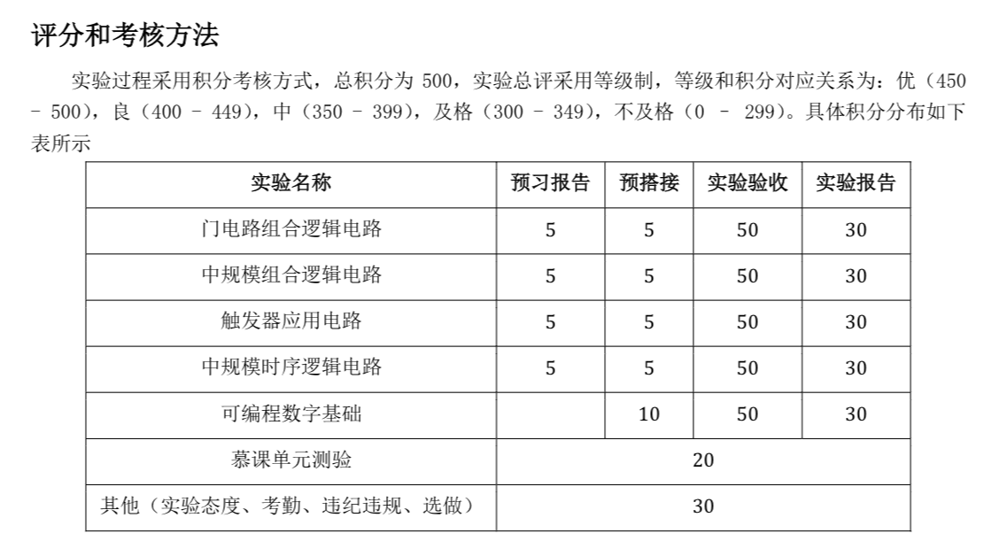
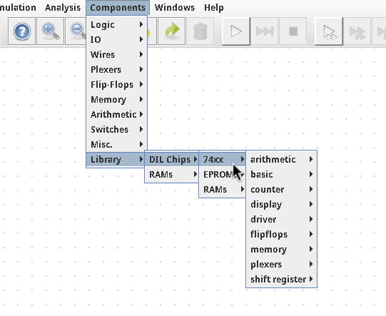
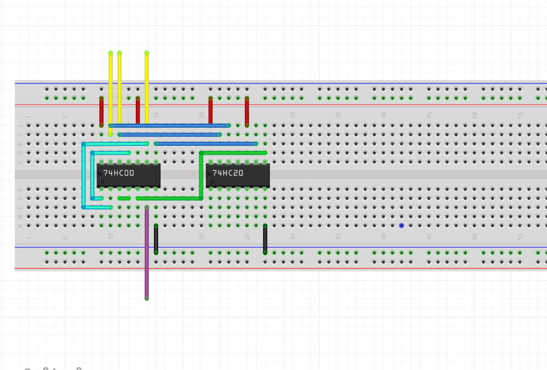

# Digital-logic-circuit

东南大学数字逻辑电路实验

# 软件准备

电子设计的软件生态非常封闭，学长遗产中的.ms13只能使用windows系统下的multisim软件查看和编辑，而multisim是个非常笨重的模拟软件。假如只是画图和分析逻辑的话，其实用不上multisim的很多功能。之后可能会考虑用轻量开源的其他工具重写学长遗产。

[seu网盘multisim下载](https://pan.seu.edu.cn/anyshare/en-us/link/AA90E0411DA3D7490CAAB0BD0DAFA0BC91?_tb=none&expires_at=1970-01-01T08%3A00%3A00%2B08%3A00&item_type=folder&password_required=false&title=Multisim&type=anonymous&verify_mobile=false)



## 电路模拟软件

对于电路仿真和逻辑化简软件，教学方案里建议的是multisim，如果用windows并且不介意电脑里多出一个又大又臃肿的闭源软件的话当然可以用。linux用户可以使用digital。

```sh
yay -S digital
```

或者使用逻辑神logisim-evolution：

```sh
yay -S logisim-evolution-bin
```

两者都需要java运行环境，但是安装的时候应该会自动安装依赖。我使用的是digital，digital强大的地方在于其自带了74系列的芯片，无需额外加载库。（预习要求里的硬件都是74开头的）



> 注：yay安装的疑似是一个没有lib的极简版，需要去[github release](https://github.com/hneemann/Digital/releases)下载压缩包，解压后找到里面的lib文件夹，在digital->edit->setting->advanced->library里将路径指向下载的lib文件夹，之后重进digital才能看到74xx。

## 绘图软件

```sh
flatpak install flathub org.fritzing.Fritzing
```

本仓库中的.fzz文件需要通过Fritzing软件打开。

[windows用户seu网盘fritzing下载](https://pan.seu.edu.cn/anyshare/en-us/link/AA945215B958044BC3B8137A9D39876954?_tb=none&expires_at=1970-01-01T08%3A00%3A00%2B08%3A00&item_type=folder&password_required=false&title=fritzing.0.9.3b&type=anonymous&verify_mobile=false)



# 贡献作业

fork我的仓库，修改内容之后提交pr，或者提issue等我改。
